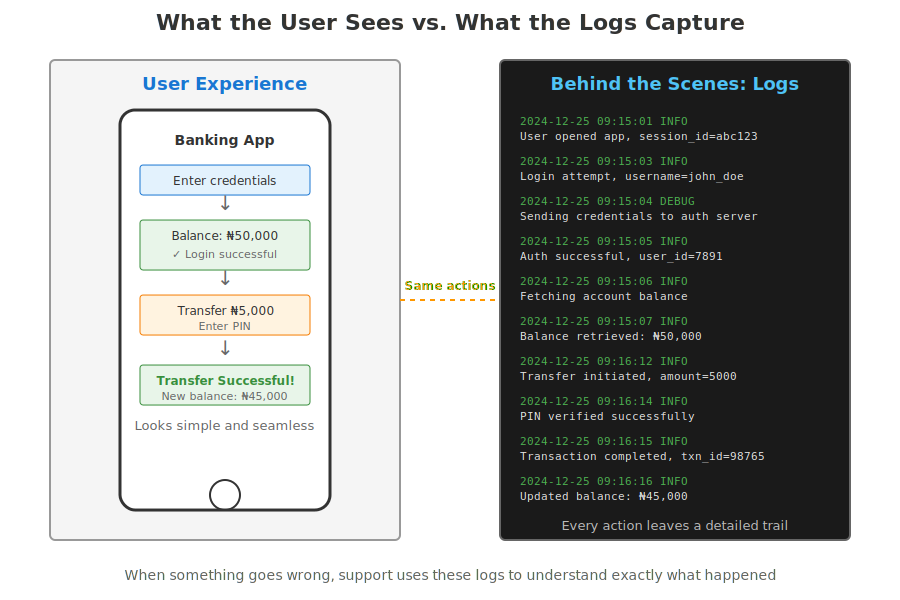
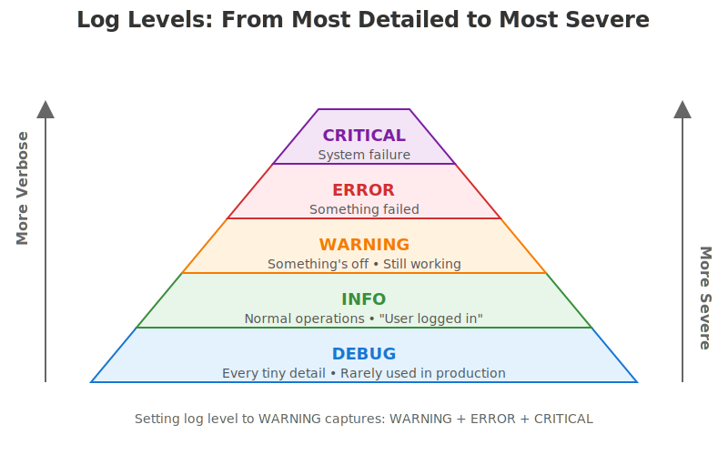
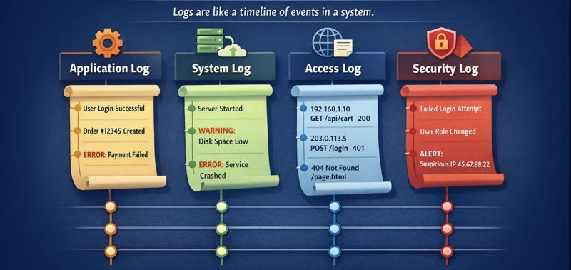

When you open an app you use every day, say a banking app, it feels simple. You log in, check your balance, make a transfer, and everything works as expected. 

But sometimes things go wrong. You might be unable to log in, or a transfer might fail but you get debited. Your next action would be to contact support. You explain the problem, and somehow (often within hours) they figure out what went wrong and fix it.

How does the support team do that? How do they investigate an issue that happened on your phone, possibly days ago, and pinpoint exactly what failed and resolve it? That process relies heavily on logs. And to understand logs is to take your [first step into observability](https://www.freecodecamp.org/news/observability-in-cloud-native-applications/).

## What are logs?
Logs are records of events that happen in a system over time. When you log into your bank app, for instance, the app sends your credentials to a server, verifies your identity, and creates a session for you. And that’s just one aspect of the user flow.

Every action you take (checking your balance, making a transfer) involves similar chains of events.
The system tracks all these activities by recording each event as it happens. These records are called logs.

### The anatomy of a log
A good log entry usually contains three key elements:
- Timestamp: Exactly when did this happen?
- Context/Payload: What happened?
- Severity Level: How important is this?

A typical log entry might look like:
2024-12-24 14:32:15 INFO User john_doe logged in successfully
2024-12-24 14:32:47 ERROR Database connection failed: timeout after 30s
2024-12-24 14:33:01 WARNING Disk space below 10% on /dev/sda1

## The ‘severity levels’ of logs
Not all events are equally important. Some things are just routine operations, while others are urgent problems. This is where log levels come in.

- `DEBUG` is the play-by-play of every tiny step. "Called function X with these parameters." "Starting loop iteration 5." This level of detail is usually too noisy for everyday use, but it's invaluable when you're hunting down exactly where something went wrong.
- `INFO` records normal, noteworthy events. "User logged in." "File saved successfully." "Server started." Everything is working fine—you're just keeping a record of what's happening.
- `WARNING` means something's odd but not broken yet. "Database query took unusually long." "Disk space is running low." "Had to retry this operation." The system is still working, but something deserves attention.
- `ERROR` means something actually failed. "Couldn't save to database." "Payment service is down." A specific operation didn't work, though the overall system might still be running.
- `CRITICAL` (or `FATAL`) is the "everything's on fire" level. "Out of memory, shutting down." "Cannot connect to database at all." The system can't continue operating.

### How log levels work
When you set your logging level, you're setting a threshold. The logger (the part of a program or system responsible for creating logs) will capture that level and everything above it.

So if you set your logging level to `WARNING`, you'll see `WARNING`, `ERROR`, and `CRITICAL`. You won't see `DEBUG` and `INFO`.
If you set it to `INFO`, you'll see `INFO`, `WARNING`, `ERROR`, and `CRITICAL`. You won't see `DEBUG`.
If you set it to `DEBUG`, you'll see everything because `DEBUG` is the lowest level.

The reason for having these levels is to filter out the noise. In normal operations, you might only look at `WARNING` and above to avoid drowning in millions of `INFO` messages. But when something goes wrong and you need to investigate, you can turn on `DEBUG` to see absolutely everything that led up to the problem.

## Types of logs
Logs are usually categorized by where they come from and what they are trying to track. Think of it like a hospital: you have "medical charts" for patients (Application logs), "building security footage" for the hallways (Security logs), and "utility reports" for the electricity and plumbing (System logs).

Here are the most common types of logs:

### 1. Application logs
Application logs are generated by the specific software you’re using (like the banking app in the intro). They record events that happen inside the code. They track events such as user logins, specific button clicks, database queries, and internal code errors.

Example:

    INFO User 42 initiated transfer of ₦50,000
    ERROR Transfer failed: insufficient balance

Application logs are usually the first place engineers look when debugging user-reported issues, because they directly reflect application behavior.

### 2. System logs
System logs come from the operating system (Windows, macOS, Linux, or Android) or the environment the application runs in. They describe what’s happening at the infrastructure level. They track events like hardware failures, system startups/shutdowns, driver issues, and low-level memory errors.

Example:

    WARNING Disk usage at 92%
    ERROR nginx service failed to restart

These logs help IT teams figure out if a problem is with the app itself or with the machine on which the app is running.

### 3. Access logs
Access logs record who accessed a system, what they accessed, and when. They’re commonly generated by web servers, APIs, and gateways. Examples of access logs are incoming HTTP requests, API calls, response status codes, and request duration.

Example:

    192.168.1.10 - POST /api/transfer 500 230ms
    Access logs help understand usage patterns and investigate suspicious activity.

### 4. Network logs
These record the traffic moving between different devices or over the internet. They track IP addresses, "handshakes" between servers, and firewall activity (which connections were blocked or allowed). They help to troubleshoot slow internet speeds or detect a massive cyberattack (like a DDoS attack).

Example:

    ERROR Firewall blocked outbound traffic to payments-service:443

### 5. Security and Audit logs
Audit logs track sensitive operations for compliance and accountability. In banking systems, audit logs record who approved a transaction, who modified account settings, or who accessed customer data. These logs are often legally required and must be protected against tampering.

Example:

    WARNING Failed login attempt for user admin from IP 203.0.113.45

In many systems, audit logs are immutable (append-only and cannot be altered after being written), which makes any attempted tampering immediately detectable. Because of this, audit logs are critical for compliance, investigations, and incident response.

### 6. Error logs
Error logs specifically capture failures and exceptions. While errors often appear inside application logs, some systems separate them into dedicated error logs to make problems easier to spot and investigate.

In practice, these different log types might all flow into the same centralized logging system, but keeping them conceptually separate helps engineers know where to look when investigating specific issues.

Also note that in real production systems, log types are not perfectly separated into neat boxes. A single event can show up in multiple logs, depending on who is recording it and for what purpose.

For example, a failed login attempt might appear in:
- an access log (a request was made),
- a security log (authentication failed), and
- an audit log (a sensitive action was attempted).

The same applies to the other log types. One action can trigger several components, and each component may log the event from its own perspective. This overlap gives engineers multiple angles to understand what happened.

## Why do logs matter?
Without logs, software is a "black box." You can see what goes in and what comes out, but you have no idea what happens inside the box. Logs serve several important purposes:

### 1. Troubleshooting
When a user reports a bug, logs allow you to "travel back in time." Instead of trying to recreate the error manually, you can look at the logs to see exactly what the code was doing the moment the error occurred.

### 2. Security
Logs are vital for security. If a hacker tries to gain access to a system, they usually leave a trail of "Failed Login" logs. Companies use these logs to identify suspicious patterns and prove compliance with security regulations.

### 3. Performance monitoring
While logs are usually about events, they can also tell you about speed. If a log shows a request started at 10:00:01 and finished at 10:00:05, you know that specific process took 4 seconds—which might be way too slow.

## Where logs live
In simple applications, logs might just be written to a file on the same machine where the program runs. But as systems grow more complex, logging architectures become more sophisticated.

Centralized logging is common in production environments. Centralized logging means that instead of logs scattered across dozens or hundreds of servers, everything flows to a central location where you can search across all your systems at once. A typical setup might look like:

    Application → Local logging agent → Central log server → Search and visualization tools

The local agent collects logs from multiple applications, batches them together efficiently, and ships them to a central server. Engineers can then search, filter, and visualize logs from across the entire infrastructure in one place.

Popular tools in this space include Elasticsearch, VictoriaLogs, Splunk, Datadog, and various open-source solutions.

## Wrapping Up
You’ve now seen how the support team is able to investigate the issue with your bank app. They looked at the logs. Logs turn systems from black boxes into something engineers can reason about, investigate, and fix.

On their own, logs already tell a useful story about what's going on under the hood of an application. But in modern systems, they’re just one part of a bigger picture. Logs are often combined with other signals like metrics and traces, and together these form the foundation of observability.
